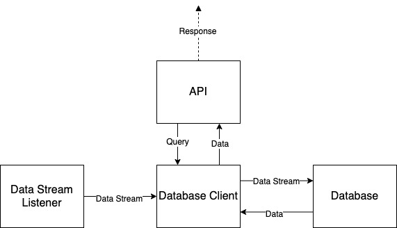

# worlder-group-backend-developer-coding-assigment

## Architecture

- follows a event-driven architecture

### Data Stream Listener

- randomly generates data and produce data to database client component

### Database Client

- consumes data from data stream listener component
- stores data into MySQL database
- setups server to listen from API component

### API

- Recieves request from user
- Sends request to Database Client component
- Recieves response from Database Client component